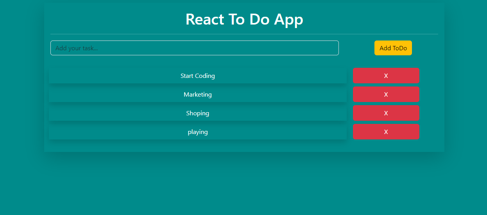

# React To-Do App

This repository contains a simple to-do application built using React.js. The app demonstrates the fundamental concepts of React such as state management, setState, props, lifting state up, handling events, and utilizes Bootstrap for styling.

## Features
 - Add and Remove Tasks: Easily add new tasks to the to-do list and remove them when completed.
 - Responsive Design: Utilizes Bootstrap for a responsive and user-friendly interface.

## Technologies Used
 - React: Utilized React.js for building a dynamic and interactive user interface.
 - Bootstrap: Used Bootstrap for styling and layout components.
 - JavaScript: The app is primarily built using JavaScript for functionality.
 - HTML & CSS: Basic HTML and CSS for structure and additional styling.

 
